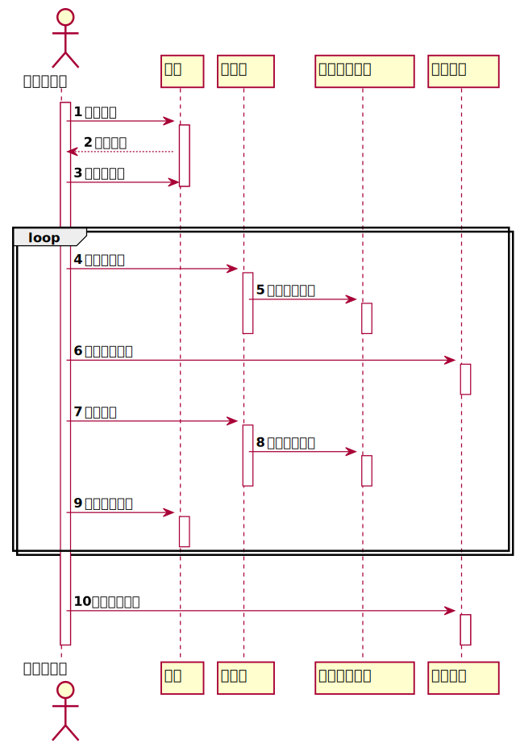

# 实验4：图书管理系统顺序图绘制
|学号|班级|姓名|
|:-------:|:-------------: | :----------:|
|201710414427|软件(本)17-4|张露平|

## 图书管理系统的顺序图

## 1. 借书用例
## 1.1. 借书用例PlantUML源码

``` sequence
@startuml
'借出资源顺序图
actor 图书管理员
activate 图书管理员
autonumber
图书管理员 -> 读者:验证读者
activate 读者
读者 --> 图书管理员:读者信息
图书管理员 -> 读者:取读者限额
deactivate 读者
||30||
loop
  图书管理员 -> 资源项:获取资源项
  activate 资源项
  资源项 -> 馆藏资源品种:查找资源品种
  activate 馆藏资源品种
  deactivate 资源项
  deactivate 馆藏资源品种

  图书管理员 -> 借书记录:创建借书记录
  activate 借书记录
  deactivate 借书记录

  图书管理员 -> 资源项:借出资源
  activate 资源项
  资源项 -> 馆藏资源品种:减少可借数量
  activate 馆藏资源品种
  deactivate 资源项
  deactivate 馆藏资源品种

  图书管理员 -> 读者:减少可用限额
  activate 读者
  deactivate 读者
end loop
||30||
图书管理员 -> 借书记录:打印借书清单
activate 借书记录
deactivate 借书记录
deactivate 图书管理员
@enduml
```

## 1.2. 借书用例顺序图


## 1.3. 借书用例顺序图说明

- 绘制图时使用actor关键字来声明参与者
- 此顺序图通过借阅资源（图书）的相关流程步骤进行绘制
- 借阅资源时借阅者可能不是只借一本图书，所以此顺序图使用到了loop循环


***

## 2. 还书用例
## 2.1. 还书用例PlantUML源码

``` sequence
@startuml
'归还资源顺序图
actor 图书管理员
activate 图书管理员

autonumber
图书管理员 -> 资源项:读取资源信息
activate 资源项

资源项 -> 借书记录:取借书记录
activate 借书记录
借书记录 --> 资源项:借书记录
deactivate 借书记录
资源项 -> 馆藏资源品种:取资源品种
activate 馆藏资源品种
deactivate 馆藏资源品种
deactivate 资源项
图书管理员 -> 读者:取借阅者信息
activate 读者
读者 --> 图书管理员:借阅者信息
deactivate 读者
图书管理员 -> 资源项:归还资源
activate 资源项
资源项 -> 馆藏资源品种:增加可借数量
activate 馆藏资源品种
deactivate 馆藏资源品种
deactivate 资源项
图书管理员 -> 借书记录: 登记还书日期
activate 借书记录
deactivate 借书记录
opt 逾期
   图书管理员 -> 逾期记录:登记逾期记录
   activate 逾期记录
   deactivate 逾期记录
end opt
||30||
图书管理员 -> 读者: 增加可用限额
activate 读者
deactivate 读者
deactivate 图书管理员
@enduml
```

## 2.2. 还书用例顺序图


## 2.3. 还书用例顺序图说明

- 绘制图时同样使用actor关键字来声明参与者
- 此顺序图通过归还资源（图书）的相关流程步骤进行绘制
- 如果借阅者在归还图书时超出了正常的归还时间，则需要进行逾期记录等，但是不是所以的借阅者都会逾期，所以使用一个opt（选项）来判断当逾期这件事为真时进行的相关操作
- 当借阅证归还资源（图书）成功后，如果没有特别情况，则需要当时修改该借阅者的可用限额
***

## 3. 管理读者信息用例
## 3.1. 管理读者信息用例PlantUML源码

``` sequence
@startuml
'图书管理员管理读者顺序图
actor "图书管理员\n(系统管理员)" as A
activate A
autonumber

A -> 登录界面:输入用户名和密码
activate 登录界面
登录界面 -> 数据库:请求确认用户名和密码的合法性和正确性
activate 数据库
数据库 --> 登录界面:确认用户名和密码的合法性和正确性
deactivate 数据库
登录界面 --> A: 显示登录成功
登录界面 -> 主页面:打开主页面
activate 主页面
deactivate 主页面
deactivate 登录界面


alt 查询读者
  A -> 主页面:选择查询读者信息功能
  activate 主页面
  A -> 主页面:选择需要查询的读者
  主页面 -> 读者信息界面:打开查询读者信息页面
  activate 读者信息界面
  deactivate 主页面
  A -> 读者信息界面:点击查询
  读者信息界面 -> 数据库:请求返回读者信息
  activate 数据库
  数据库 --> 读者信息界面: 返回读者信息
  deactivate 数据库
  A -> 读者信息界面: 退出查询
  deactivate 读者信息界面
||50||
else 删除读者
  autonumber 6
  A -> 主页面:选择删除读者功能
  activate 主页面
    主页面 -> 读者信息界面:打开需要被删除的读者信息页面
    activate 读者信息界面
    deactivate 主页面
    A -> 读者信息界面:点击删除
    读者信息界面 -> 数据库:删除读者信息
    activate 数据库
    数据库 -> 数据库:更新数据库
    数据库 --> 读者信息界面: 返回读者是否被删除成功
    deactivate 数据库
    A -> 读者信息界面: 返回主页面
    deactivate 读者信息界面
||50||
else 添加读者
  autonumber 6
    A -> 主页面:选择添加读者功能
    activate 主页面
    主页面 -> 添加读者信息填写界面:打开填写读者信息页面
    activate 添加读者信息填写界面
    deactivate 添加读者信息填写界面
    deactivate 主页面
    A -> 读者信息界面:点击添加
    activate 读者信息界面
    读者信息界面 -> 数据库:添加读者信息
    activate 数据库
    数据库 -> 数据库:更新数据库
    数据库 --> 读者信息界面: 返回读者是否被添加成功
    deactivate 数据库
    A -> 读者信息界面: 返回主页面
    deactivate 读者信息界面
||50||
else 修改读者
  autonumber 6
      A -> 主页面:选择修改读者功能
      activate 主页面
      主页面 -> 读者信息编辑界面:打开读者信息编辑页面
      activate 读者信息编辑界面
      deactivate 读者信息编辑界面
      deactivate 主页面
      A -> 读者信息界面:点击确认修改
      activate 读者信息界面
      读者信息界面 -> 数据库:修改读者信息
      activate 数据库
      数据库 -> 数据库:更新数据库
      数据库 --> 读者信息界面: 返回读者是否修改成功
      deactivate 数据库
      A -> 读者信息界面: 返回主页面
      deactivate 读者信息界面
end alt
||40||
读者信息界面 -> 主页面:打开主页面
activate 读者信息界面
deactivate 读者信息界面
activate 主页面
deactivate 主页面
deactivate A
@enduml
```

## 3.2. 管理读者信息用例顺序图


## 3.3. 管理读者信息用例顺序图说明

- 此顺序图虽然只是图书管理员管理读者信息的顺序图，但是此顺序图是从图书管理员开始登陆系统开始
- 按照相关的正常顺序进行绘制
- 因为考虑到管理读者信息包括对读者信息的增删查改操作，每个操作又有一点区别，所以这里使用了alt分支语句来判断管理员需要对读者采取哪种管理操作，通过分支来达到相应的操作流程
***

## 4. 用户登录用例
## 4.1. 用户登录用例PlantUML源码

``` sequence
@startuml
'登录顺序图
actor "用户(管理员和读者)" as A
activate A
autonumber
A -> 登录界面:登录(用户名、密码)
activate 登录界面
登录界面 -> 登录管理:登录(用户名、密码)
activate 登录管理
登录管理 -> 服务器:登录(用户名、密码)
activate 服务器
服务器 -> 数据库
activate 数据库
create 用户
数据库 -> 用户
数据库 --> 服务器:返回一个用户对象
deactivate 数据库
服务器 --> 登录管理: 返回一个用户对象
deactivate 服务器
登录管理 -> 登录管理:判断用户对象是否为空
登录管理 -> 登录管理:判断用户密码是否正确
登录管理 --> 登录界面: 返回一个用户对象
deactivate 登录管理
登录界面 -> 主页面:打开主页面
deactivate 登录界面
activate 主页面
deactivate 主页面
deactivate A
@enduml
```

## 4.2. 用户登录用例顺序图


## 4.3. 用户登录用例顺序图说明

- 此顺序图根据一般的用户登录系统的方式的流程进行绘制
- 该顺序图有一个登录管理参与者，在获取到一个用户后，在该参与者中需要对用户进行身份的判断，以达到正确、安全的让用户登录到系统
- 当用户登录时输入自己的用户名和密码，通过服务器调用数据库，就相当于新建了一个用户，返回该用户，最后在登录管理中就行判断

***

## 5. 管理图书信息用例
## 5.1. 管理图书信息用例PlantUML源码

``` sequence
@startuml
'图书管理员管理图书顺序图
actor 图书管理员 as A
activate A
autonumber
A -> 登录界面:输入用户名和密码
activate 登录界面
登录界面 -> 数据库:请求确认用户名和密码的合法性和正确性
activate 数据库
数据库 --> 登录界面:确认用户名和密码的合法性和正确性
deactivate 数据库
登录界面 --> A: 显示登录成功
登录界面 -> 主页面:打开主页面
activate 主页面
deactivate 主页面
deactivate 登录界面

alt 查询图书
  A -> 图书管理界面:确认查询方式
  activate 图书管理界面
  deactivate 图书管理界面
  A -> 图书管理界面:输入查询方式
  activate 图书管理界面
  图书管理界面 -> 查询操作:进行查找
  activate 查询操作
  deactivate 图书管理界面
  查询操作 -> 数据库:得到查询结果
  activate 数据库
  数据库 --> 查询操作:返回查询结果
  deactivate 数据库
  A -> 查询操作:返回到图书管理界面
  查询操作 -> 图书管理界面:打开图书管理页面

  activate 图书管理界面
 deactivate 图书管理界面
 deactivate 查询操作
  ||50||

else 修改图书

   autonumber 6
   A -> 图书管理界面:对需要修改的图书进行修改
   activate 图书管理界面
   图书管理界面 -> 修改操作:修改图书
   activate 修改操作
   deactivate 图书管理界面
   修改操作 -> 数据库:修改图书信息
   activate 数据库
   数据库 --> 修改操作:返回是否修改成功
   deactivate 数据库
     A -> 修改操作:返回到图书管理界面
     修改操作 -> 图书管理界面:打开图书管理页面
     activate 图书管理界面
     deactivate 图书管理界面
     deactivate 修改操作

     ||50||
else 删除图书
   autonumber 6
      A -> 图书管理界面:选择删除操作
      activate 图书管理界面
      图书管理界面 -> 删除操作:删除图书
      activate 删除操作
      deactivate 图书管理界面
      删除操作 -> 数据库:删除图书信息
      activate 数据库
      数据库 --> 删除操作:返回是否删除成功
      deactivate 数据库
        A -> 删除操作:返回到图书管理界面
        删除操作 -> 图书管理界面:打开图书管理页面
        activate 图书管理界面
        deactivate 图书管理界面
        deactivate 删除操作
        ||50||
else 添加图书
  autonumber 6
     A -> 图书管理界面:选择添加图书
     activate 图书管理界面
     图书管理界面 -> 添加操作:添加图书
     activate 添加操作
     deactivate 图书管理界面
     添加操作 -> 数据库:添加图书信息
     activate 数据库
     数据库 --> 添加操作:返回是否添加成功
     deactivate 数据库
       A -> 添加操作:返回到图书管理界面
       添加操作 -> 图书管理界面:打开图书管理页面
       activate 图书管理界面
       deactivate 图书管理界面
       deactivate 添加操作
end alt
||40||
A -> 图书管理界面:退出系统
activate 图书管理界面
destroy 图书管理界面
deactivate A

@enduml
```

## 5.2. 管理图书信息用例顺序图


## 5.3. 管理图书信息用例顺序图说明

- 此顺序图虽然只是图书管理员管理图书信息的顺序图，但是此顺序图也是从图书管理员开始登陆系统开始
- 按照相关的正常顺序进行绘制
- 同样因为考虑到管理图书信息包括对图书信息的增删查改操作，每个操作也有一点区别，所以这里也使用了alt分支语句来判断管理员需要对图书采取哪种管理操作，通过分支来达到相应的操作
***

### 问题：顺序图和流程图各自有什么优缺点，或者说该在什么时候使用什么图效果更好？
