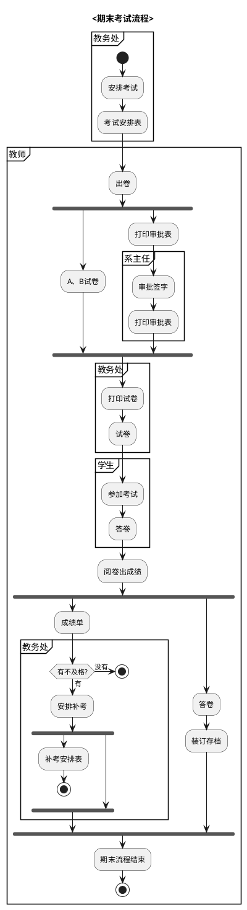
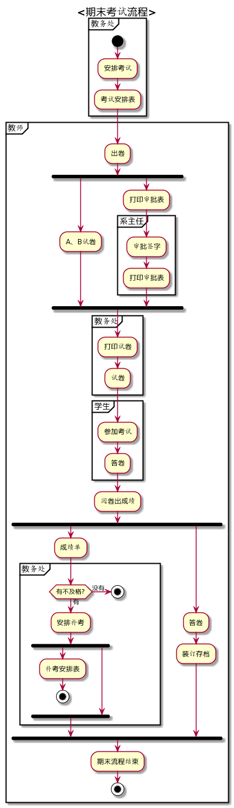
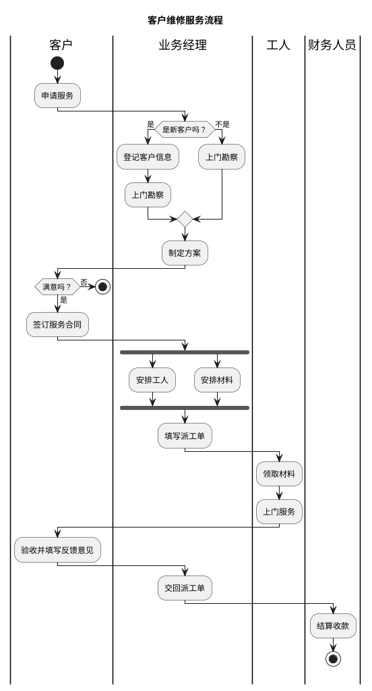
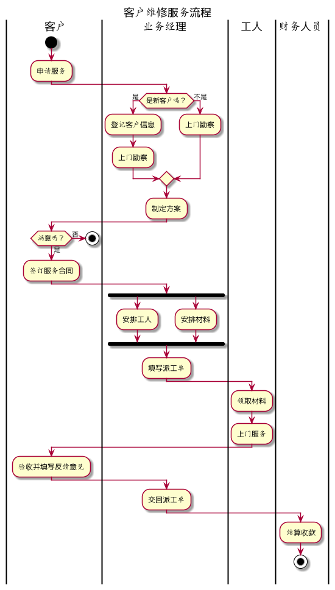

# 实验1：业务流程建模
|学号|班级|姓名|
|:-------:|:-------------: | :----------:|
|201710414427|软件(本)17-4|张露平|

## 流程图1：考试及成绩管理流程

**PlantUML源码如下：**

**业务流程图如下：**

**流程说明：**

此流程图是按照PlantUml活动图的新语法（beta版本）实现的，活动标签都是以冒号开始，以分号结束。
其中也使用了if...else...的条件语句来判断分支情况，使用关键字fork，fork again和end fork来处理并行关系，即两个活动可以同时进行
，在这其中使用关键字detach移除箭头，使不需要进行下一个业务的活动停止或者转到其他业务流程。其中最重要的就是使用到了组合，通过定义分区(partition)，多个活动组合(group)在一起，这里就对教师、教务处、系主任、学生分成四个区，每个区处理不同业务，
最终完成了这个流程图。

## 流程图2： 客户维修服务流程

**PlantUML源码如下：**

**业务流程图如下：**

**流程说明：**

此流程图主要是运用到了泳道(Swimlanes)，使用管道符`|`来定义每个泳道，并分别为每个泳道定义名字，比如这里的
客户、工人、业务经理、财务人员。同样也使用到了if...else...条件语句对其中的一些关系进行判断，也使用了
关键字fork，fork again和end fork来处理并行关系，最终完成了这个流程图。

